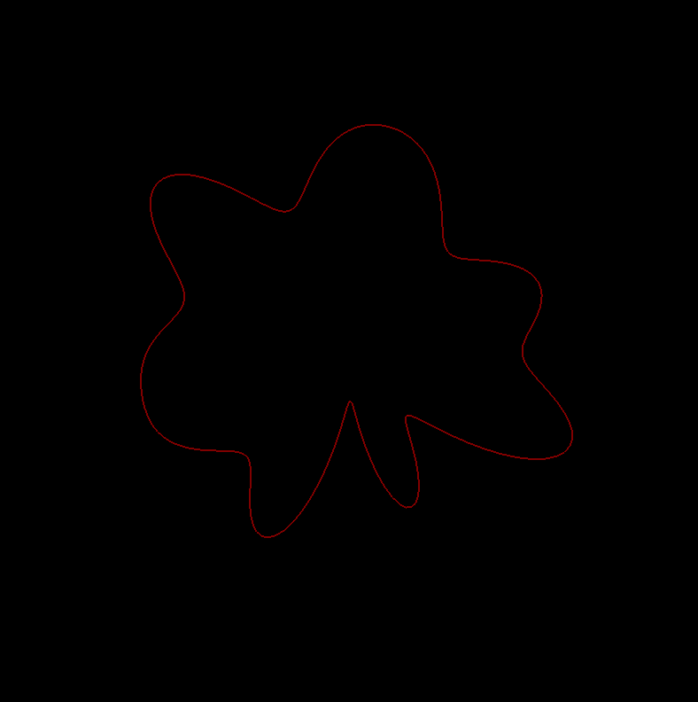

# 04 Gaussian Process with Periodic Kernel




```python
# -*- coding: utf-8 -*-
import sys
import numpy as np
from matplotlib import pyplot as plt
import GPy

import pyof as of


class ofApp(of.ofPyBaseApp):
    def setup(self):
        of.ofSetWindowTitle('Gaussian Process')
        of.ofSetFrameRate(2)
        of.ofEnableSmoothing()

        # ---- colormap ----
        cmap = plt.get_cmap('prism')
        self.colors = [tuple(map(lambda x: int(x*255), cmap(n)[:3]))
                       for n in range(cmap.N)]

        # ---- Compute Gaussian Process ----
        w = of.ofGetWidth()

        self.N_sim = 200
        self.N_sample = 1

        self.x_sim = np.linspace(0, 2*np.pi, self.N_sim)
        self.y_sim = np.zeros((self.N_sample, self.N_sim))

        kernel = GPy.kern.src.periodic.PeriodicMatern32(
            input_dim=1, variance=1, lengthscale=0.05
        )

        # Mean function
        self.mu = np.zeros(self.N_sim)
        # Cov function
        self.cov = kernel.K(self.x_sim[:, np.newaxis],
                            self.x_sim[:, np.newaxis])

    def update(self):
        self.y_sim = np.random.multivariate_normal(self.mu, self.cov,
                                                   size=self.N_sample)

    def draw(self):
        w = of.ofGetWidth()
        h = of.ofGetHeight()
        of.ofTranslate(w / 2.0, h / 2.0, 0.0)

        of.ofBackground(0, 255);
        of.ofNoFill()
        of.ofSetLineWidth(2.0)

        for n in range(self.N_sample):

            cl = self.colors[n % len(self.colors)]
            of.ofSetColor(cl[0], cl[1], cl[2], 128)

            of.ofBeginShape()
            uu = (2.0 + self.y_sim[n]) * 100 * np.cos(self.x_sim)
            vv = (2.0 + self.y_sim[n]) * 100 * np.sin(self.x_sim)
            for u, v in zip(uu, vv):
                of.ofVertex(u, v)
            of.ofEndShape(False)

if __name__ == '__main__':
    app = ofApp()
    app.run(800, 800, of.OF_WINDOW)
```